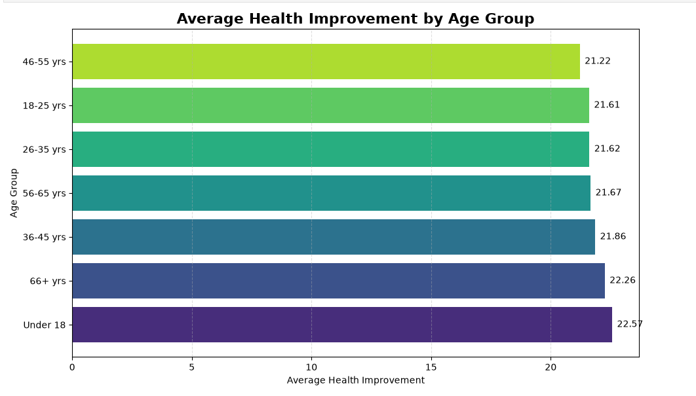
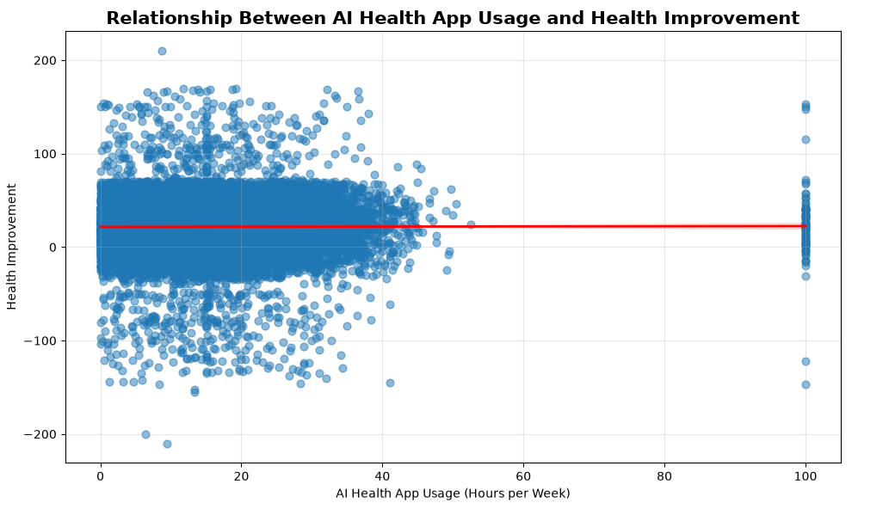
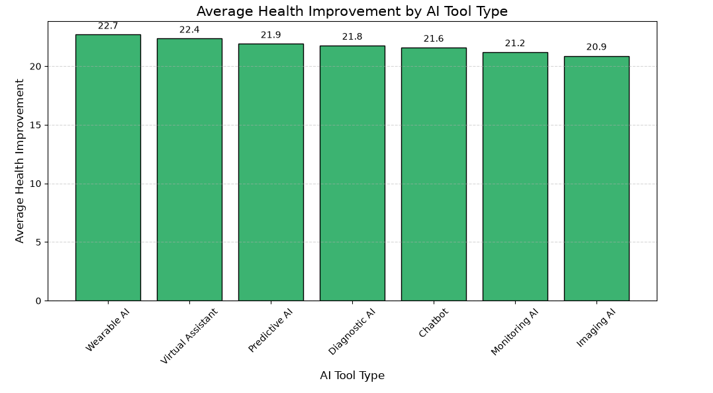
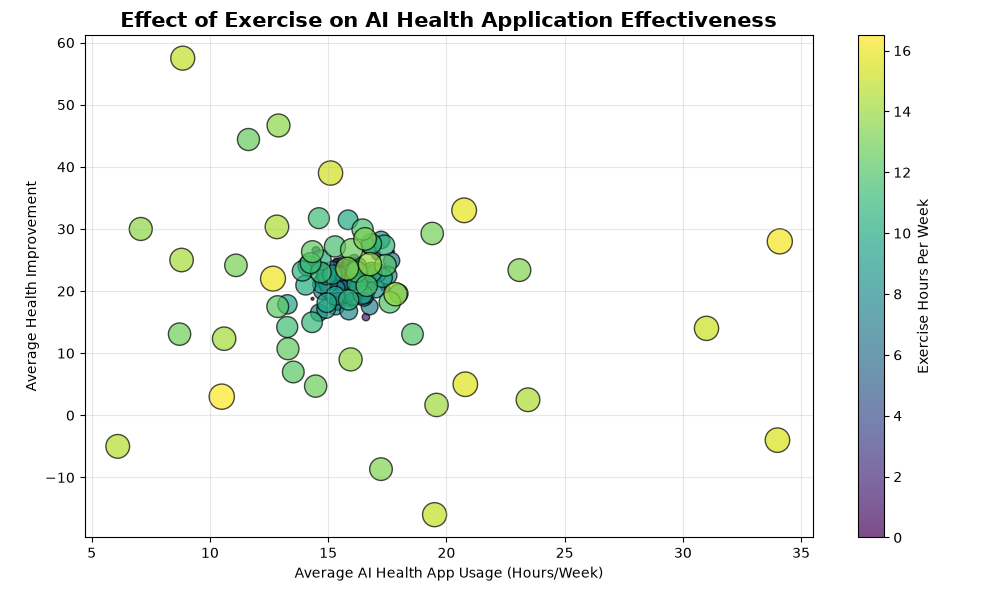
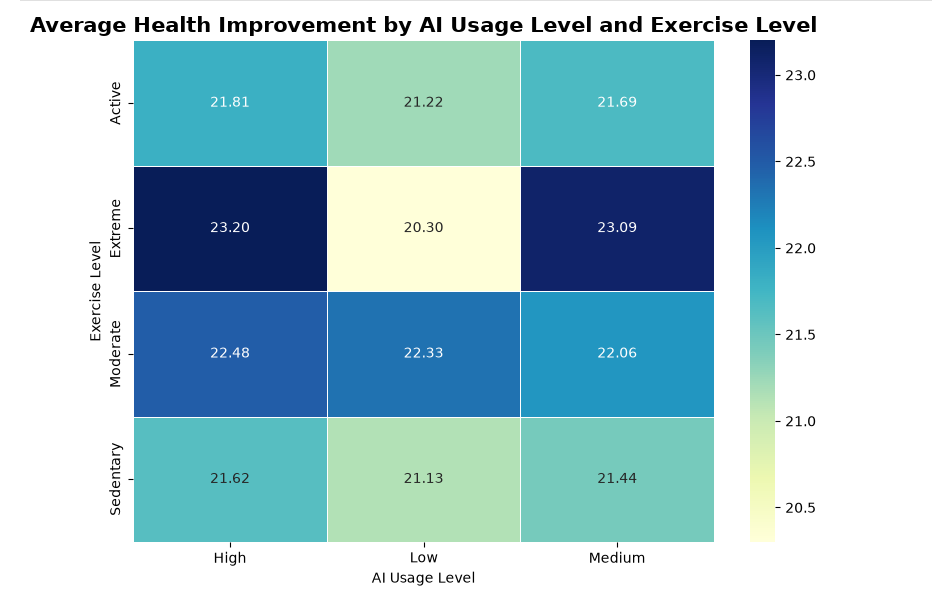
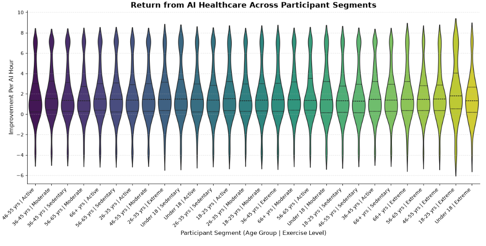
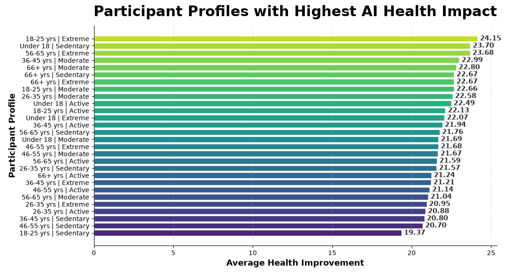

<div align="center">

# 🏥 AI Healthcare Outcomes Analysis

### Analysing the Impact of Artificial Intelligence on Health Outcomes Using Python

<p>
An end-to-end Healthcare Data Analytics project that explores how Artificial Intelligence influences health improvement, patient satisfaction, exercise effectiveness, BMI categories, and healthcare outcomes through data cleaning, exploratory data analysis, and insightful visualizations.
</p>

<p>


</p>

</div>

---

# 📌 Project Overview

Artificial Intelligence (AI) is transforming the healthcare industry by enabling personalized care, improving diagnosis, and supporting better clinical decision-making.

This project analyzes a real-world healthcare dataset to understand how AI-based healthcare applications influence patient health improvement. Using Python-based data analysis techniques, the project performs data cleaning, exploratory data analysis (EDA), and visualization to discover meaningful healthcare insights.

The analysis focuses on identifying relationships between AI usage, exercise habits, BMI, age groups, satisfaction levels, chronic conditions, and overall health improvement.

---

# 🎯 Objectives

- Analyze the impact of AI healthcare applications on patient health improvement.
- Perform comprehensive data cleaning and preprocessing.
- Explore healthcare trends using Exploratory Data Analysis (EDA).
- Generate meaningful business insights through data visualization.
- Identify participant groups that benefit the most from AI-assisted healthcare.
- Support healthcare decision-making using data-driven analysis.

---

# 🛠️ Tech Stack

| Category | Technologies |
|----------|--------------|
| Programming Language | Python |
| Development Environment | Jupyter Notebook |
| Data Manipulation | Pandas, NumPy |
| Data Visualization | Matplotlib, Seaborn |
| Analysis | Exploratory Data Analysis (EDA), Statistical Analysis |

---

# 📂 Dataset Information

The healthcare dataset contains information related to participants using AI-powered healthcare applications.

### Key Features

- Age
- Gender
- BMI
- Exercise Level
- Chronic Condition
- AI Tool Type
- AI Usage Hours
- AI Usage Level
- Health Score Before AI
- Health Score After AI
- Improvement
- Improvement Per AI Hour
- Satisfaction Level
- Participant Profile
- Risk Category

---

# ✨ Project Features

- Data Cleaning & Preprocessing
- Missing Value Handling
- Duplicate Record Removal
- Feature Engineering
- Exploratory Data Analysis (EDA)
- Statistical Analysis
- Business Insight Generation
- Professional Data Visualization
- Healthcare Trend Analysis
- Participant Segmentation

---

# 📊 Visualizations Used

This project includes multiple visualization techniques:

- 📊 Bar Chart
- 📈 Horizontal Bar Chart
- 🥧 Pie Chart
- 🔵 Scatter Plot
- 📉 Regression Plot
- 🔥 Heatmap
- 🎻 Violin Plot
- 📦 Box Plot
- 🫧 Bubble Plot
- 📉 Stem Plot

---

# 📋 Business Questions Solved

This project answers several business-oriented healthcare questions, including:

1. Which Age Group gains the highest health improvement after using AI health applications?
2. Do participants who spend more time on AI health apps achieve significantly better health outcomes?
3. Which AI Tool Type delivers the highest average health improvement?
4. Does exercise amplify the effectiveness of AI health applications?
5. Which Age Group shows the highest adoption of AI health applications?
6. Which BMI category benefits the most from AI-driven healthcare?
7. How does satisfaction vary with health improvement?
8. Do participants with chronic conditions experience greater improvement than healthy participants?
9. Which combination of AI Usage Level and Exercise Level produces the highest health improvement?
10. Which age groups are least satisfied despite using AI health applications?
11. Are participants with higher BMI spending more time on AI health applications?
12. Which AI Tool Type has the highest participant share?
13. Which participant segment receives the highest return from AI healthcare?
14. What factors are most strongly associated with health improvement?
15. Which participant profiles should healthcare companies target for maximum AI impact?
16. Can participants be grouped into distinct health behavior segments based on AI usage and lifestyle?
17. Which participant groups have high AI usage but low health improvement?
18. AI Usage vs Health Improvement Across Participant Groups.
19. Comparative analysis of AI usage and health improvement patterns.

---

# 📊 Project Workflow

```text
Healthcare Dataset
        │
        ▼
Data Understanding
        │
        ▼
Data Cleaning & Preprocessing
        │
        ▼
Exploratory Data Analysis (EDA)
        │
        ▼
Statistical Analysis
        │
        ▼
Data Visualization
        │
        ▼
Business Insights
        │
        ▼
Healthcare Decision Support
```

---

# 📸 Project Preview

## 1️⃣ Health Improvement Across Age Groups

<p align="center">

</p>

> Compares the average health improvement across different age groups to identify which age category benefits the most from AI-assisted healthcare.

---

## 2️⃣ AI Usage Hours vs Health Improvement

<p align="center">

</p>

> Regression analysis showing the relationship between AI application usage time and health improvement.

---

## 3️⃣ Average Improvement by AI Tool Type

<p align="center">

</p>

> Highlights which AI healthcare tool provides the highest average health improvement.

---

## 4️⃣ Exercise Level vs AI Effectiveness

<p align="center">

</p>

> Bubble Plot illustrating how exercise habits influence the effectiveness of AI healthcare applications.

---

## 5️⃣ AI Usage Level & Exercise Level Heatmap

<p align="center">

</p>

> Heatmap showing which combination of AI usage and exercise level achieves the greatest health improvement.

---

## 6️⃣ Participant Segment Analysis

<p align="center">

</p>

> Violin Plot comparing the distribution of health improvement per AI usage hour across participant segments.

---

## 7️⃣ High-Impact Participant Profiles

<p align="center">

</p>

> Identifies participant profiles that receive the maximum benefit from AI-driven healthcare, helping organizations target the most impactful user groups.

---

# 💡 Key Insights

- AI healthcare applications contribute positively to overall health improvement across participants.
- Higher AI usage is generally associated with better health outcomes.
- Exercise enhances the effectiveness of AI-assisted healthcare applications.
- Certain AI tool types consistently deliver higher average health improvement.
- Participant demographics such as age and BMI influence AI healthcare effectiveness.
- Correlation analysis reveals strong relationships between AI usage, health scores, and improvement.
- Data-driven insights can help healthcare organizations identify high-impact participant groups for personalized interventions.

---

# 📁 Repository Structure

```text
AI-Healthcare-Outcomes-Analysis
│
├── 📓 AI_Healthcare_Outcomes_Analysis.ipynb
├── 📊 ai_health_impact_dirty_25k.csv
├── 📄 README.md
├── 📄 requirements.txt
├── 📄 LICENSE
│
└── 📁 Images
      ├── age_group_improvement.png
      ├── ai_usage_vs_improvement.png
      ├── ai_tool_improvement.png
      ├── exercise_effectiveness.png
      ├── ai_usage_exercise_heatmap.png
      ├── participant_segment_violin.png
      └── business_profiles.png
```

---

# 🚀 Getting Started

## Clone the Repository

```bash
git clone https://github.com/your-username/AI-Healthcare-Outcomes-Analysis.git
```

---

## Navigate to the Project

```bash
cd AI-Healthcare-Outcomes-Analysis
```

---

## Install Required Libraries

```bash
pip install -r requirements.txt
```

---

## Launch Jupyter Notebook

```bash
jupyter notebook
```

Open:

```
AI_Healthcare_Outcomes_Analysis.ipynb
```

Run all cells to reproduce the complete analysis.

---

# 📦 Requirements

The project uses the following Python libraries:

- NumPy
- Pandas
- Matplotlib
- Seaborn
- Jupyter Notebook

---

# 🎯 Skills Demonstrated

### Data Analysis

- Data Cleaning
- Data Preprocessing
- Feature Engineering
- Missing Value Handling
- Duplicate Record Removal
- Exploratory Data Analysis (EDA)

### Data Visualization

- Bar Charts
- Horizontal Bar Charts
- Pie Charts
- Scatter Plots
- Regression Plots
- Heatmaps
- Violin Plots
- Box Plots
- Bubble Plots
- Stem Plots

### Business Analytics

- Healthcare Data Analysis
- Trend Identification
- Correlation Analysis
- Participant Segmentation
- Business Insight Generation
- Data-Driven Decision Making

---

# 🔮 Future Enhancements

- Develop Machine Learning models for health outcome prediction.
- Build an interactive Power BI dashboard.
- Deploy the project as a Streamlit web application.
- Integrate real-time healthcare datasets.
- Create personalized AI healthcare recommendation systems.

---

# 📜 License

This project is licensed under the **MIT License**.

Feel free to use, modify, and share this project with proper attribution.

---

# 🙋‍♂️ Author

**Kumkum Lohiya**

🎓 B.Tech Computer Science Engineering

💼 Aspiring Data Analyst

### Connect With Me

- 💼 LinkedIn: *https://www.linkedin.com/in/kumkum-lohiya/*
- 💻 GitHub: *https://github.com/Kumkum-lohiya/*
- 📧 Email: *kumkumlohiya20@gmail.com*
*

---

<div align="center">

## ⭐ If you found this project useful, don't forget to Star this repository!

Thank you for visiting my project! 😊

</div>
